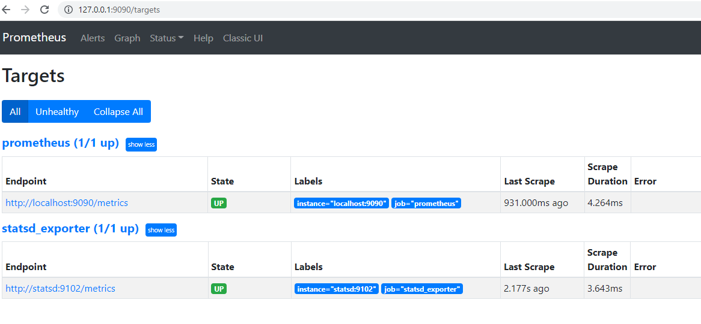
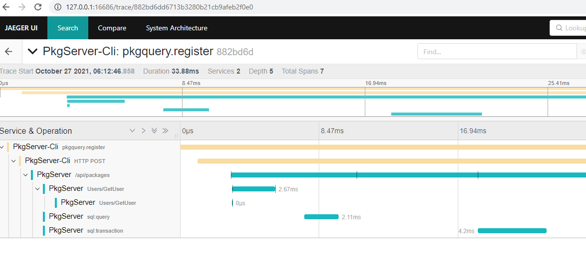

# Appendix A - Making your applications observable

Instructions for building and running.

## Pre-requisites

You will need to be able to run software installation programs on your computer.
Thus, on Linux, you will need `sudo` priveleges. For Windows, you will need to
be able to run and install programs. 

You will also need to do the following for running PowerShell scripts:

Run PowerShell as an administrator, then enable the execution policy. 
Please make sure you understand the [implications](https://adamtheautomator.com/run-powershell-script/) of doing this.


```
PS C:\Windows\system32> Set-ExecutionPolicy RemoteSigned

Execution Policy Change
The execution policy helps protect you from scripts that you do not trust. Changing the execution policy might expose
you to the security risks described in the about_Execution_Policies help topic at
https:/go.microsoft.com/fwlink/?LinkID=135170. Do you want to change the execution policy?
[Y] Yes  [A] Yes to All  [N] No  [L] No to All  [S] Suspend  [?] Help (default is "N"): A
```
## Installation

You will need [Docker Desktop](https://www.docker.com/products/docker-desktop) installed for Windows and MacOS. For Linux, you will  need the docker engine
and docker compose installed.


## Run statsd, prometheus and jaeger

Instead of running the statsd server originally created by [etsy](https://github.com/statsd/statsd), we will run [statsd_exporter](https://github.com/prometheus/statsd_exporter). The key reason we do so, i.e. preferring the second option is that 
it allows us to view the metrics via [prometheus web UI](https://prometheus.io). 

We will also start a container running [jaeger](https://www.jaegertracing.io/) as our
distributed tracing server.

The [docker-compose.yml](./docker-compose.yml) sets this all up.

Run:

```
docker-compose up
```

After a few minutes where docker images will be downloaded if this is the first time you are running, you will have three containers running (verify that using `docker ps`). 

Now, vist the URL http://127.0.0.1:9090/targets in your browser, and you should see 
a web page, like this:



The key, is the second endpoint, which tells us that it can read the data from the statsd server correctly. Our Go applications will send metrics to `statsd` and prometheus server will read the data from statsd. We will then, soon learn to view and query the metrics from `prometheus`.

Next, visit the URL http://127.0.0.1:16686/search from your browser - this should show you the Jaeger Web UI:


## Run the gRPC server

Build and run the gRPC server in your command line application/terminal window 1.

### Windows

```
PS C:\> cd grpc-server\server
PS C:\> go build

PS C:\> .\run_server.ps1
{"level":"info","version":"0.1","time":"2021-10-27T05:25:24+11:00", message":"Starting gRPC server"}
```

### Linux/MacOS

```
$ cd grpc-server/server
$ go build
$ ./run_server.sh
{"level":"info","version":"0.1","time":"2021-10-27T05:25:24+11:00", message":"Starting gRPC server"}
```

## Run the HTTP server

Before we run the HTTP server, start a local MinIO server and a MySQL database server: 

### Linux/MacOS

In a new terminal window:

```
$ cd http-server
$ ./scripts/localsetup_minio.sh
```


In a new terminal window:

```
$ cd http-server
$ ./scripts/localsetup_mysql.sh
```

### Windows

In a new terminal window:

```
PS C:\> cd http-server
PS C:\> .\scripts\localsetup_minio.ps1
```


In a new terminal window:

```
PS C:\> cd http-server
PS C:\> .\scripts\localsetup_mysql.ps1
```


Create a new bucket, `test-bucket` in MinIO by going to: http://127.0.0.1:9001/buckets
in your browser, logging in with username and password as `admin` and `admin123`
respectively.

Run the HTTP server next. 

### Linux/MacOS

In a new terminal window:

```
$ cd http-server
$ go build

$ ./scripts/run_server.sh
{"level":"info","version":"0.1","time":"2021-10-27T06:03:53+11:00","message":"Starting HTTP server"}
```

### Windows

In a new terminal window:

```
C:\> cd http-server
C:\> go build

C:\> .\scripts\run_server.ps1
{"level":"info","version":"0.1","time":"2021-10-27T06:03:53+11:00","message":"Starting HTTP server"}
```


## Run the Package CLI

### Windows

```
PS C:\> cd command-line-app
PS C:\> go build

PS C:\> .\run_client.ps1
{"level":"info","version":"0.1","command":"register","time":"2021-10-27T06:12:46+11:00","message":"Uploading package..."}
{"level":"debug","version":"0.1","command":"register","time":"2021-10-27T06:12:46+11:00","message":"Making HTTP POST request"}
{"level":"debug","version":"0.1","command":"register","time":"2021-10-27T06:12:46+11:00","message":"pkgregister.PkgData{Name:\"test\", Version:\"0.7\", Filename:\"main.go\", Bytes:(*os.File)(0xc000006040)}"}
Package uploaded: 4/test-0.7-main.go

C:\>

```

### Linux/MacOS

```
$ cd command-line-app
$ go build

$ ./run_client.sh
{"level":"info","version":"0.1","command":"register","time":"2021-10-27T06:12:46+11:00","message":"Uploading package..."}
{"level":"debug","version":"0.1","command":"register","time":"2021-10-27T06:12:46+11:00","message":"Making HTTP POST request"}
{"level":"debug","version":"0.1","command":"register","time":"2021-10-27T06:12:46+11:00","message":"pkgregister.PkgData{Name:\"test\", Version:\"0.7\", Filename:\"main.go\", Bytes:(*os.File)(0xc000006040)}"}
Package uploaded: 4/test-0.7-main.go
$ 
```


## Viewing the distributed traces

Now, go to the Jaeger Web UI: http://127.0.0.1:16686/search in your browser, select `PkgServer-Cli` from the Service drop down box
on the top left and click on "Find Traces". You should see trace data from your applications.



## Viewing the metrics

Go to the Prometheus Web UI: http://127.0.0.1:9090 and query for metrics.

For the HTTP server:

http://127.0.0.1:9090/graph?g0.expr=pkgserver_http_request_latency

For the gRPC server:

http://127.0.0.1:9090/graph?g0.expr=userssvc_grpc_unary_latency

For the command line app:

http://127.0.0.1:9090/graph?g0.expr=cmd_duration

The measurements are all reported in seconds.

# Clean up

For terminating the MySQL, MinIO, HTTP and gRPC servers, you can simply run Ctrl + C or close the command
line terminal where the programs were started.

For terminating the docker containers:

```
docker-compose rm -fsv
```

(You will have some errors when running the demo in Appendix-B if you don't perform the clean up here)
