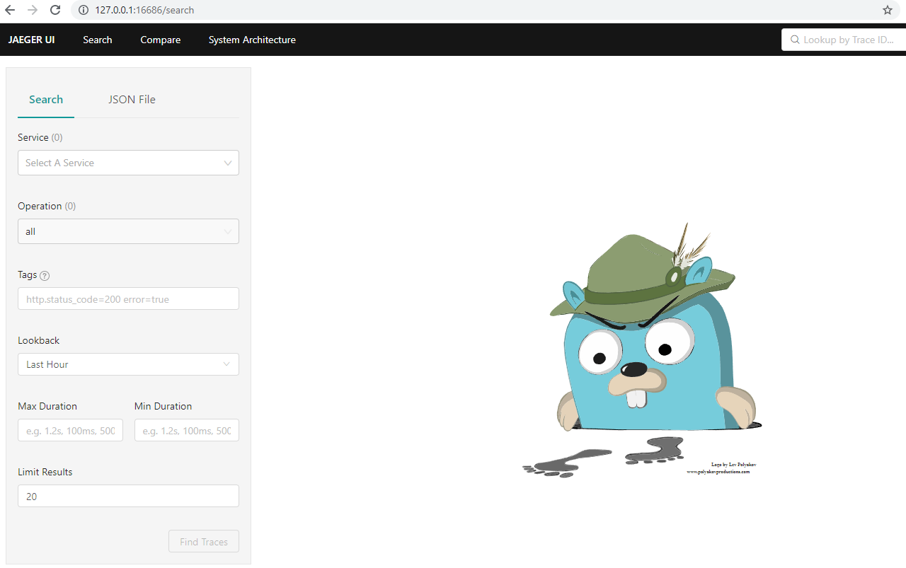

# Appendix B - Deploying Applications

Instructions for building and running.

## Pre-requisites

You will need to be able to run software installation programs on your computer.
Thus, on Linux, you will need `sudo` priveleges. For Windows, you will need to
be able to run and install programs. 

You will also need to do the following for running PowerShell scripts:

Run PowerShell as an administrator, then enable the execution policy. 
Please make sure you understand the [implications](https://adamtheautomator.com/run-powershell-script/) of doing this.


```
PS C:\Windows\system32> Set-ExecutionPolicy RemoteSigned

Execution Policy Change
The execution policy helps protect you from scripts that you do not trust. Changing the execution policy might expose
you to the security risks described in the about_Execution_Policies help topic at
https:/go.microsoft.com/fwlink/?LinkID=135170. Do you want to change the execution policy?
[Y] Yes  [A] Yes to All  [N] No  [L] No to All  [S] Suspend  [?] Help (default is "N"): A
```
## Installation

You will need [Docker Desktop](https://www.docker.com/products/docker-desktop) installed for Windows and MacOS. 
For Linux, you will need the docker engine and docker compose installed.

## Build the docker images

Command line application (`practicalgo/pkgcli`)

```
$ cd command-line-app

# Windows
C:\> .\build-docker-image.ps1

# Linux/MacOS
$ ./build-docker-image.sh

```

HTTP server (`practicalgo/pkgserver`)

```
$ cd http-server

# Windows
C:\> .\build-docker-image.ps1

# Linux/MacOS
$ ./build-docker-image.sh
```

gRPC server: (`practicalgo/users-svc`)

```
$ cd grpc-server

# Windows
C:\> .\build-docker-image.ps1

# Linux/MacOS
$ ./build-docker-image.sh
```


## statsd, prometheus and jaeger

Instead of running the statsd server originally created by [etsy](https://github.com/statsd/statsd), we will run [statsd_exporter](https://github.com/prometheus/statsd_exporter). The key reason we do so, i.e. preferring the second option is that 
it allows us to view the metrics via [prometheus web UI](https://prometheus.io). 

We will also start a container running [jaeger](https://www.jaegertracing.io/) as our
distributed tracing server.

## Running them all

The [docker-compose.yml](./docker-compose.yml) runs containers to run the above servers, along with running a MySQL
server, a MinIO container as well as the HTTP and gRPC servers using the images you built above

Run `docker-compose up` (or `docker compose up`):

```
$ docker-compose up

Creating statsd                 ... done
Creating appendix-b_pkgserver_1 ... done
Creating prometheus             ... done
Creating appendix-b_jaeger_1    ...
Creating appendix-b_users-svc_1 ... done
Creating appendix-b_minio_1     ...
Creating appendix-b_mysql_1     ... do
```

After a few minutes where docker images will be downloaded if this is the first time you are running, you will have 
seven containers running. Verify that by running `docker ps` from a new command line terminal window:

```
C:\> docker ps --format '{{.Names}}'

prometheus
appendix-b_mysql_1
appendix-b_jaeger_1
statsd
appendix-b_users-svc_1
appendix-b_pkgserver_1
appendix-b_minio_1
```

At any point of time, if you want to view the logs from any of the containers, run `docker logs <container name>`.
For example, to view the logs from the package server:

```
C:\> docker logs  appendix-b_pkgserver_1
{"level":"info","version":"0.1","time":"2021-10-30T21:25:45Z","message":"Starting HTTP server"}
```

Create a new bucket, `test-bucket` in MinIO by going to: http://127.0.0.1:9001/buckets
in your browser, logging in with username and password as `admin` and `admin123`
respectively.


Now, vist the URL http://127.0.0.1:9090/targets in your browser, and you should see 
a web page, like this:


The key, is the second endpoint, which tells us that it can read the data from the statsd server correctly. Our Go applications will send metrics to `statsd` and prometheus server will read the data from statsd. We will then, soon learn to view and query the metrics from `prometheus`.

Next, visit the URL http://127.0.0.1:16686/search from your browser - this should show you the Jaeger Web UI:



## Run the Package CLI

We are going to run the package CLI as a container using the docker image we built earlier.

What we will be doing is running the container in the same docker network as the other
containers above, so we specify the network name via the `--network` option.
Hence, as a result, we are able to use the docker compose service name
to communicate with the package server, `pkgserver` as well as
`statsd` and `jaeger` (as you can see in [config.yaml](./command-line-app/config.yml).

### Windows

```
PS C:\> cd appendix-b\command-line-app

PS C:\> docker run -v ${PWD}:/data -e X_AUTH_TOKEN=token-123 `
        --network appendix-b_default `
        -ti practicalgo/pkgcli `
        register `
        -name "test" -version 0.7 -path /data/main.go `
        http://pkgserver:8080

{"level":"info","version":"0.1","command":"register","time":"2021-10-30T21:43:28Z","message":"Uploading package..."}
Package uploaded: 4/test-0.1-/data/main.go

C:\>

```

### Linux/MacOS

```
$ cd command-line-app

$ docker run -v ${PWD}:/data -e X_AUTH_TOKEN=token-123 \
      --network appendix-b_default \
      -ti practicalgo/pkgcli \
      register \
      -name "test" -version 0.7 -path /data/main.go \
      http://pkgserver:8080
{"level":"info","version":"0.1","command":"register","time":"2021-10-30T21:43:28Z","message":"Uploading package..."}
Package uploaded: 4/test-0.1-/data/main.go

$ 
```


## Viewing the distributed traces

Now, go to the Jaeger Web UI: http://127.0.0.1:16686/search in your browser, select `PkgServer-Cli` from the Service drop down box
on the top left and click on "Find Traces". You should see trace data from your applications.


## Viewing the metrics

Go to the Prometheus Web UI: http://127.0.0.1:9090 and query for metrics.

For the HTTP server:

http://127.0.0.1:9090/graph?g0.expr=pkgserver_http_request_latency

For the gRPC server:

http://127.0.0.1:9090/graph?g0.expr=userssvc_grpc_unary_latency

For the command line app:

http://127.0.0.1:9090/graph?g0.expr=cmd_duration

The measurements are all reported in seconds.

## Cleanup

For terminating the docker containers, run the following from a terminal window:

```
$ cd appendix-b
$ docker-compose rm -fsv
```